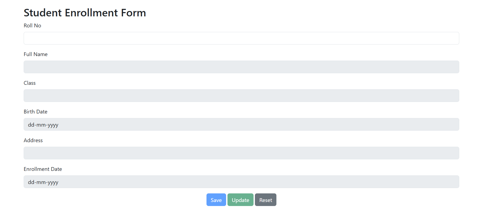
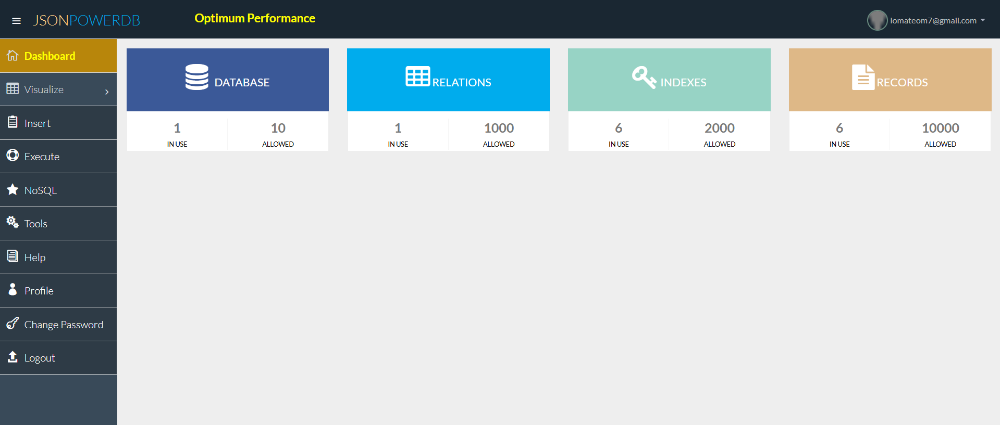
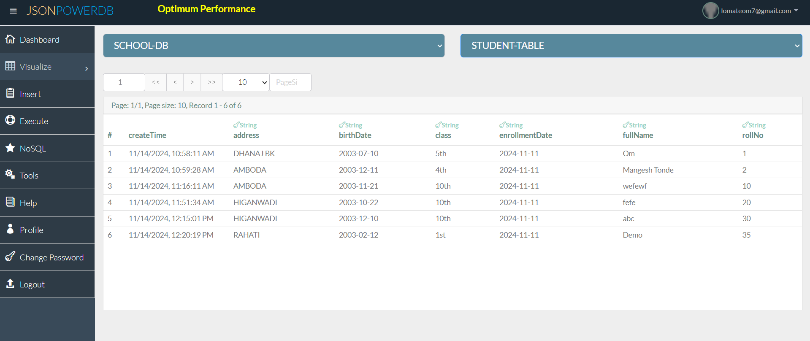

# Student Enrollment Form with JsonPowerDB

## Description
This project allows users to manage student enrollment data with the use of JsonPowerDB (JPDB), a powerful and flexible API for handling JSON data. It enables the creation, updating, and viewing of student records in a school database through a simple web interface.

The form allows users to input student details such as roll number, full name, class, birth date, address, and enrollment date, and then store this information in a database using JsonPowerDB's API.

## Benefits of using JsonPowerDB
- **Fast Data Retrieval**: JsonPowerDB is built for quick and efficient handling of large JSON data.
- **Schema-Free**: It allows users to store data without the need for predefined schemas, making it very flexible for various applications.
- **Real-Time Updates**: JPDB provides support for real-time updates and queries on the JSON data stored in the database.
- **Easy Integration**: Easy integration with web applications using standard HTTP requests and simple JSON format.

## Release History
- **v1.0.0**: Initial release of the Student Enrollment Form integrated with JsonPowerDB.

## Table of Contents
- [Project Title](#student-enrollment-form-with-jsonpowerdb)
- [Description](#description)
- [Benefits of using JsonPowerDB](#benefits-of-using-jsonpowerdb)
- [Release History](#release-history)
- [Scope of Functionalities](#scope-of-functionalities)
- [Examples of Use](#examples-of-use)
- [Project Status](#project-status)
- [Sources](#sources)
- [Screenshots](#screenshots)

## Scope of Functionalities
- **Add Student Record**: Users can input new student records (roll number, name, class, birthdate, address, enrollment date).
- **Update Existing Record**: If a student already exists, their information can be updated by searching via roll number.
- **View Student Record**: Existing records can be viewed by inputting the roll number.
- **Reset Form**: The form can be reset to its initial state after adding or updating a student record.

## Examples of Use
1. **Adding a New Student**:
   - Input details into the form and click the "Save" button.
   - The student record is stored in JsonPowerDB.

2. **Updating a Student Record**:
   - Input the roll number of an existing student.
   - The form is populated with the current student data.
   - After editing, click "Update" to save the changes to the database.

## Project Status
- The project is fully functional and ready for deployment.
- The next steps include improving the UI and expanding the functionalities for additional database interactions.

## Sources
- [JsonPowerDB](https://www.jsonpowerdb.com/)
- [Bootstrap](https://getbootstrap.com/) (For form styling and layout)

## Screenshots
1. **Student Enrollment Form**  
   
   
2. **Database Dashboard**  
   

3. **Data in Database**  
   

## Other Information
- Ensure you have a valid JsonPowerDB connection token to interact with the database.
- This project uses AJAX for seamless communication with JsonPowerDB
